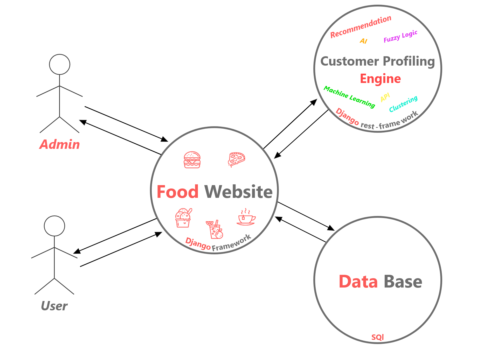

# Food-Website
I've developed this project in Django-Framework as the website of my graduation project, it's contains two applications(management, food_website) and work at real time when admit commit any change.

